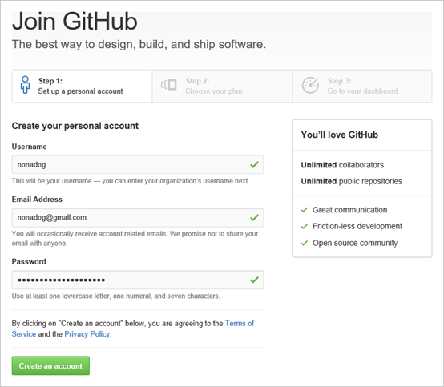
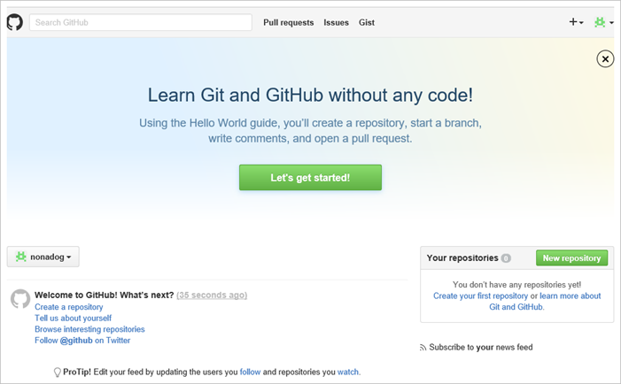

# Ditt alldeles egna och privata GitHub-konto

Här hittar du anvisningar som visar dig steg för steg de olika moment du är tvungen att utföra för att skapa ditt egna GitHub-konto du kommer att behöva under kursen.

>För att kunna följa alla steg i denna guide behöver du tillgång till den mejladress som du fått av Linnéuniversitetet. Du måste med andra ord ha [hämtat ut ett studentkonto](https://lnu.se/utbildning/under-studierna/it-och-support/guider/studentkonto/skapa-ett-studentkonto/). Mejladressen behöver du knyta till ditt GitHub-konto för att kunna verifiera att du är en student vilket ger dig tillgång till speciella resurser på GitHub. 

## Steg 1. Skapa ditt personliga konto

> Har du redan ett GitHub-konto? Hoppa då till steg 4. 

Starta en webbläsare och gå till [https://github.com/join](https://github.com/join) för att skapa ett nytt GitHub-konto. Fyll i användarnamn, mejladress. lösenord och klicka på knappen __Create an account__.

> :bulb: __TIPS!__ Välj gärna ett användarnamn som inte har någon koppling till användarnamnet kopplat till ditt studentkonto på Linneuniversitetet. Välj även gärna en privat mejladress (behöver alltså inte vara den meladress du fått tillgång till då du hämtade ut ditt studentkonto).

## Steg 2. Fullfölj guiden

Verifiera att __Unlimited public repositories for free.__ under __Choose your personal plan__ är vald och klicka på knappen __Finish sign up__.

> Du behöver inte betala för privata repositorier (repon) då du kommer att få tillgång till ett antal så snart du registrerat ditt konto som studentkonto på GitHub, desssutom kommer kurser du läser tillhandahålla privata repon i den utsträckning det behövs.

## Steg 3. Ditt GitHub-konto är nu skapat

Grattis! Du har nu skapat ditt alldeles egna GitHub-konto. Några detaljer återstår dock, så forsätt följa denna guide.

## Steg 4. Koppla din studentmejladress till ditt GitHub-konto

> Angav du din studentmejladress under steg 1? Hoppa då til nästa steg.

Gå till [`https://github.com/settings/emails`](https://github.com/settings/emails) för att lägga till din studentmejladress till ditt GitHub-konto.

## Steg 5. Tala om för GitHub att du är en student

Gå till [`https://education.github.com`](https://education.github.com) för att registrera att du är en student.

